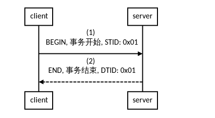
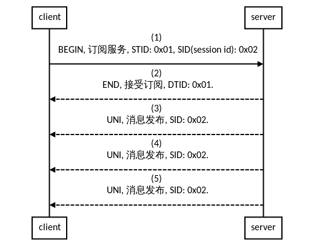
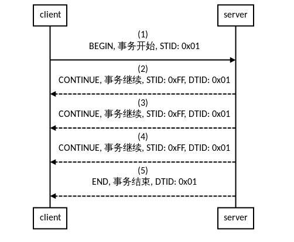
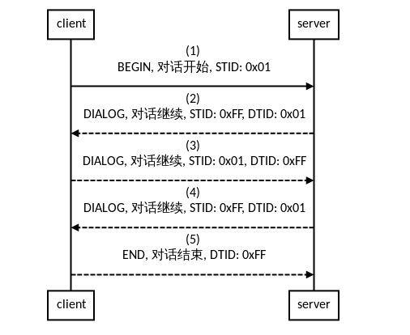
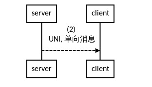
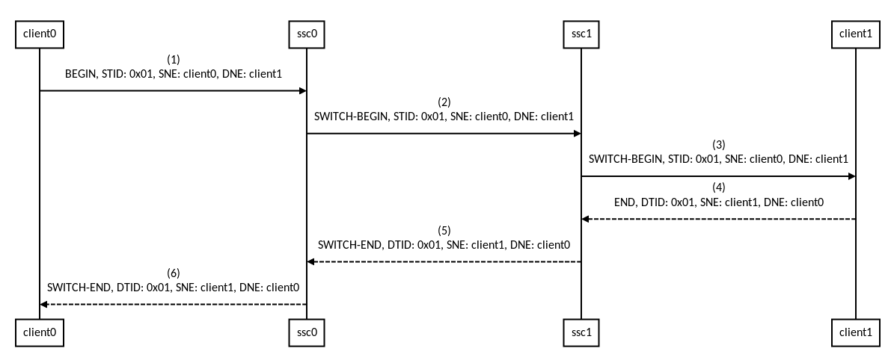

# libfsc
F server communication library

* libfsc是一个基于Actor模型的多线程并发编程框架, 它尝试向上层应用提供一个无锁, 完全异步, 网络透明的编程环境.

* 它也是一个TCP并发通信服务器开发框架, 可以处理大量的(百万计)并发连接.

* 它还是一个跨语言的RPC解决方案, 使用[STMP协议](doc/STMP.md)与[google protobuf](https://github.com/google/protobuf)作为承载. 
  * 支持request/response, unidirection, subscribe/publish, continue, dialog等通信场景.
  * 支持多级消息路由.

* 同时提供c++与java两种语言的实现.

-----

## 概念

### [STMP协议](doc/STMP.md)
 
* Simple Transaction Management Protocol, 它的灵魂是ITU-T Q.773, 一个古老而强大的协议.

### 网元(network element)

* 网络元素, 指的是一个部署在网络上的通信实体, 可能是一个server, 也可能是一个client, 或者一个gateway/router.

### N2H(network to host)

 * 从网络到本地主机的一个连接(TCP).

### H2N(host to network)

* 从本地主机到网络的一个连接(TCP).


-----

## 初始化

* libfsc总是应该初化后再使用.
* Fsc::init(), 初始化Actor调度.
* Fsc::publish(), 作为TCP服务器对外, 可以选择不调用这个函数.
* Fsc::hold(), 低精度定时器调度, 阻塞当前线程.

```cpp
#include <libfsc.h>
int main(int argc, char **argv)
{
  Log::init();
  Fsc::init(NULL);
  Fsc::publish();
  Fsc::hold();
  return EXIT_SUCCESS;
}
```

-----

## ITC(Inter-Thread Communication)应用场景

### 普通Actor

* 指的是一些与网络无关Actor之间的通信.

* 下面的代码细节:
  * `Actor(ActorType::ACTOR_ITC, Fsc::rrWk())`, 表明这是个ITC Actor, 由Fsc分配了一个固定线程用于调度它.  
  * `foo->future()`, 提交了一个lambda表达式, 这个代码块一定会在foo所属的Actor调度线程上执行.
  * `delete`, 必需在foo所属的Actor调度线程上执行.
  * `printf("foo\n")`, 这句打印几乎总是会在lambda表达式里面的printf之前输出, 这里因为lambda是一个future.

```cpp
class ActorItc: public Actor
{
public:
  ActorItc() :
    Actor(ActorType::ACTOR_ITC, Fsc::rrWk())
  {
  }

  void itc()
  {
    ActorItc* foo = new ActorItc();
    foo->future([foo]
    {
      printf("bar\n");
      delete foo;
    });
    printf("foo\n");
  }
};
```

### 可阻塞Actor

* 下面这段代码最多可能会涉及3个线程: A, B, C.
* 一个传递给可阻塞Actor的lambda表达式可以被阻塞任意时间, 这里因为它属有自己独立的调度线程(池).
* ActorBlocking构造函数的参数是调度线程的个数, 它们是抢占式的, 抢占执行被提交的lambda.
* 除了ActorBlocking之外的其它所有libfsc中的Actor都不允许阻塞, 它们必需是全异步的.

```cpp
ActorItc* foo = new ActorItc();
ActorBlocking* blk = new ActorBlocking(4);
//A
blk->future([blk, foo]
{
  //B
  //query database, etc.  
  foo->future([foo]
  {
    //C
    printf("database return\n");
  });
});
```

-----

## RPC应用

### request与response消息对



* 不要去delete req.
```cpp
StmpNet* sn = NULL;
FooReq* req = new FooReq(); //protobuf message.
sn->begin(req, [req](ushort ret, BarRsp* rsp)
{
  printf("got a response from bar\n");
}, 
[]
{
  printf("timeout or failed\n");
});
```


### subscribe与publish



```cpp
StmpNet* sn = NULL;
FooSubscribe* sub = new FooSubscribe(); //protobuf message.
sn->subscribe(sub, [sub](BarPublish* pub)
{
  printf("got a publish message from remote\n");   //在这里会持续收到publish.
}, 
[]
{
   printf("timeout or failed\n");   //订阅失败, 或者网络连接断开时会被调用.
});
```


### continue

* continue适用于一次请求可能会带来多个响应(对端认为这些响应不太容易一次性返回)的场景.

* continue不可以用subscribe/publish替代, 这里因为continue占用了底层事务id发生器.

* 这个事务id范围是0 ~ 0xFFFFFFFF, 在一个百万条消息每秒的连接上, 数天就会回到起点, 进而产生冲突, 不理解这一点可以参考[STMP协议](doc/STMP.md)

* 通信的双方都可以调用END来结束事务.



```cpp
StmpNet* sn = NULL;
FooReq* req = new FooReq(); //protobuf message.
sn->begin(req, [req](FooRsp* rsp)
{
  printf("got a response from remote\n");   //在这里会持续(但不会/不应该太多)收到rsp.
}, 
[]
{
   printf("timeout or failed\n");
});
```

### dialog

* dialog指的是通信双方在一个事务上的多次对话.



```cpp
StmpNet* sn = NULL;
FooReq* askA = new FooReq(); //protobuf message.
sn->begin(askA, [req](FooDialog* ansA, StmpTransInitiative* trans)
{
    //下面的代码会反复执行, 取决于双方的对话次数.
    if(ansA->A)
    {
      FooDialog* askB = FooDialog();
      trans.dialog(askB);
    }else
    {
      FooDialog* askC = FooDialog();
      trans.dialog(askC);
    }
}, 
[]
{
  printf("timeout or failed\n");
});
```

### unidirection

* 单向消息, 通常用于发出后, 不关心对方是否能收到.



```cpp
StmpNet* sn = NULL;
FooUni* uni = new FooReq(); //protobuf message.
sn->uni(req); //不要自己delete req.
```

-----

## 星型网络

### 一级SSC(Service Switch Center)路由

* 由多个业务模块与一个SSC组成的小型星形网络: 任意业务模块连接到SSC后, 可以调用其它模块的service.


### 多级SSC路由

* 由多个SSC组成的多层级星形网络, 通常是跨系统调用.




-----
## MISC

### 基于时间轮的低精度(1s)定时器调度.

